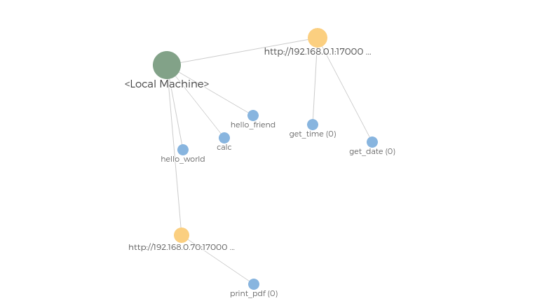

> UTesla es un proyecto de código abierto para crear redes distribuidas de servicios, fácil, rápido y seguro, usando el poder de computo de múltiples ordenadores en una única interfaz.

## Mi primer "Hello World"
**Ultra Tesla** utiliza servicios, que son básicamente mini-programas que se adhieren a la ejecución del servidor, siguiendo una sintaxis en HTTP como la siguiente: \<scheme\>://\<netloc\>/\<Service\>/\<Sub-Service\>/\<...\>

Donde *\<scheme\>* es '**http**' o '**https**' según la configuración del servidor; *\<netloc\>* es básicamente la dirección del servidor; *\<Service\>* es el nombre del servicio, que para este ejemplo será "**hello_world**" y los demás que son *\<Sub-Service\>* y *\<...\>* son básicamente otros mini-programas que se tendrán que usar anteponiendo el nombre del servicio anterior, por ejemplo, *\<Service\>/\<Sub-Service\>/\<Sub-Service 1\>/\<Sub-Service 2\>/\<...\>* y así según lo que el administrador haya propuesto.

```python
class Handler:
    async def get(self):
    	await self.write('Hello World!')
```

Un ejemplo real con el servicio nombrado como **complements/hello_world.py** en una URL se vería como lo siguiente (**suponiendo que la dirección del servidor sea localhost**): **http://localhost:17000/hello_world**

## Contactando al servidor

Lo siguiente es un script simple para poder contactarse con el servidor y obtener la salida del servicio '**hello_world**'

```python
import asyncio

from modules.Infrastructure import client

async def main():
    UTeslaClient = client.UTeslaClient('<Nombre de usuario>')
    await UTeslaClient.set_server_key('<Clave pública del servidor>')
    await UTeslaClient.set_user_keys('<Clave pública del usuario>', '<Clave privada del usuario>')

    cmd = {
        'token' : '<Token de acceso>'

    }

    Response = await UTeslaClient.fetch(
        'http://localhost:17000/hello_world',
        cmd,
        method='GET'

    )

    dec_body = UTeslaClient.get_message(Response.body)

    print(dec_body)

if __name__ == '__main__':
    asyncio.run(main())
```

Deberíamos obtener la siguiente respuesta:

```
Hello World!
```

## Creando un usuario

El administrador será el encargado de crear los usuarios, aunque perfectamente se podría automatizar como un sistema de registro cualquiera con una interfaz de usuario cualquiera, para este ejemplo se usará el *plugin* '[add](modules/Cmd/add.py)' de **UTeslaCLI**.

```bash
# Para requerir ayuda
./UTeslaCLI add --help
# Creamos el usuario
./UTeslaCLI add -u <Nombre de usuario> -p <Contraseña> -i <Ruta de la clave pública>
```

## Creación del par de claves

Tanto el servidor como el usuario deben tener sus par de claves para que la comunicación sea satisfactoria. Esto es un proceso inicial que deben hacer antes de hacer cualquier cosa (**independientemente de si es un usuario o el administrador del servidor**).

### En el cliente:

El cliente va a requerir usar el *plugin* '[generate_keys](modules/Cmd/generate_keys.py)' para la creación del par de claves

```bash
# Para requerir ayuda
./UTeslaCLI generate_keys --help
# Generamos el par de claves
./UTeslaCLI generate_keys -bit_size <Tamaño del par de claves en bits> -out-public-key <Nombre del archivo de la clave pública> -out-private-key <Nombre del archivo de la clave privada>
```

Si se ejecuta sin parámetros se generará con un tamaño de claves por defecto de **3072** bit's y las claves se mostrarán en la salida. Lo recomendable sería dejar el tamaño de claves pre-determinado y guardar el par de claves en un lugar seguro.

Ahora lo que tendría que hacer el usuario que desea registrarse es enviar la clave pública al administrador del servidor para que éste lo registre satisfactoriamente.

### En el servidor:

El proceso para generar el par de claves en el lado del servidor será mucho más simple; se hará automáticamente cuando se ejecute.

```bash
./UTesla
```

El tamaño del par de claves estará definido en [UTesla.ini](config/UTesla.ini), en la sección '**Crypt Limits**' y en la clave '**rsa_key_length**'.

<br>

**Lo recomendable es dejar el tamaño de claves pre-determinado tanto del lado del cliente y del servidor, y se debe tener en cuenta que el tamaño de claves debe ser igual o equivalente en las dos partes.**

## Creación del token de acceso

**UTesla** requiere de un token de acceso para realizar la mayoría de acciones, en este caso el cliente deseoso por obtener su token tiene que usar el *plugin* '[generate_token](modules/Cmd/generate_token.py)'

```bash
./UTeslaCLI generate_token <La URL del servidor> -u <El nombre de usuario> -p <La contraseña del usuario> -s <La clave pública del servidor> -i <La clave pública del usuario> -I <La clave privada del usuario>
```

Una vez hecho lo anterior y la petición haya sido satisfactoria, se mostrará el token de acceso, el cual debe ser almacenado en un lugar seguro para su posterior uso.

## Uso de la distribución de servicios

Supongamos que en el mundo haya dos servidores y los administradores se conozcan, uno de éstos contiene uno o más servicios que otro no tiene, pero un cliente que requiera el uso de ese servicio usando la URL del primer servidor (**por ejemplo**) no tendría ningún inconveniente, ya que si el servicio deseado no se encuentra en el primer servidor, éste hará una búsqueda en la red y determinará qué servidor es el que contiene ese servicio, posteriormente obtendría una respuesta como si fuera el mismo cliente y luego la redirige hacia el cliente mismo, por lo que todo sería transparente.

Lo anterior es muy útil si se desea separar ciertos servicios entre servidores, por cuestiones económicas, de recursos, una mejoría en la implementación o cualquier cosa que se desee, al fin y al cabo, el usuario es el que lo decide.

Para estos ejemplos el primer servidor será '**http://localhost:17000**' y el segundo '**http://localhost:17001**'. El segundo tiene un servicio llamado '**hello_friend**', pero nosotros "**los clientes**" vamos a creer que el servicio está en el primer servidor, por lo cual lo usaremos para interactuar con éste.

**complements/hello_friend.py**:

```python
class handler:
    async def get(self):
        await self.write('hello friend!')
```

Por diseño, el administrador del segundo servidor debe crear un usuario como si fuera cualquier otro. Por lo que debe saber cómo crearlo, cosa que ya se hablo en anteriores secciones. En este caso nosotros lo llamaremos '**utesla**'.

Además, como ya se aclaró en anteriores secciones, la mayoría de operaciones requieren de un token de acceso, por lo se va a suponer que se tiene hecho este paso para el nuevo usuario **utesla**.

Una vez aclarado todo lo que se tiene que hacer, vamos un paso más allá y obtengamos los servicios del segundo servidor (**http://localhost:17001**) para el primer servidor (**http://localhost:17000**)

```bash
./UTeslaCLI add_network http://localhost:17001 -s <Clave pública del segundo servidor> -p keys/key.pub -P keys/key.priv -u utesla -t <Token de acceso>
```

Como esto es un ejemplo, se usan las claves que por defecto se almacenan en la carpeta '[keys](keys)' del primer servidor; se usa el usuario '**utesla**' que ya debe estar creado en el segundo servidor y nos contactamos con el servidor '**http://localhost:17001**' para obtener sus servicios.

Como paso final, el cliente desea obtener el servicio '**hello_friend**' y si todo ha salido bien, obtendrá su posterior salida, aunque lo peculiar de todo esto es que el cliente hará una petición al primer servidor en vez de al segundo.

Lo siguiente será muy parecido a lo que se observó en anteriores secciones, pero lo único que cambió es el nombre del servicio:

```python
import asyncio

from modules.Infrastructure import client

async def main():
    UTeslaClient = client.UTeslaClient('<Nombre de usuario>')
    await UTeslaClient.set_server_key('<Clave pública del servidor>')
    await UTeslaClient.set_user_keys('<Clave pública del usuario>', '<Clave privada del usuario>')

    cmd = {
        'token' : '<Token de acceso>'

    }

    Response = await UTeslaClient.fetch(
        'http://localhost:17000/hello_friend',
        cmd,
        method='GET'

    )

    dec_body = UTeslaClient.get_message(Response.body)

    print(dec_body)

if __name__ == '__main__':
    asyncio.run(main())
```

Deberíamos obtener la siguiente respuesta:

```
Hello Friend!
```

Como se puede apreciar, es un proceso muy sencillo y lo mejor, es transparente para el usuario.

## Dependencias

**Arch Linux**:
* **mariadb**

**Debian**:
* **mariadb-server**
* **libmariadb-dev**
* **python3-dev**

## Instalación

```bash
git clone --recursive https://github.com/UltraTesla/UTesla.git
cd UTesla
```

**Arch Linux**:
```bash
sudo pacman -S mariadb
```

**Debian**:
```bash
sudo apt-get install mariadb-server libmariadb-dev python3-dev
```

**General**:
```bash
sudo systemctl start mariadb.server
python3 -m pip install -r requirements.txt
./UTesla
```

**Es recomendable configurar primero antes de iniciar [UTesla](UTesla) (como el nombre de usuario y la contraseña en MySQL)**

## Contribuyendo

Al igual que cada proyecto nuevo creado, soy imperfecto y puedo equivocarme, pero con todo el gusto del mundo aceptaré tu contribución, ya sea por código o no, porque hay que recordar que se trata de abarcar muchos idiomas de distintas regiones del mundo y en éso puede haber múltiples defectos.

## Notas

* El proyecto fue probado en **Debian** y **Arch Linux**
* No se ha probado en **Windows** u otro sistema operativo
* El proyecto usa un **protocolo propio** y **no** uno **estándar**
* El proyecto no está definido, de eso se encarga el mismo usuario
* Todo el proyecto fue probado en la versión **3.8.2** y **3.7.3** de python

~ DtxdF
