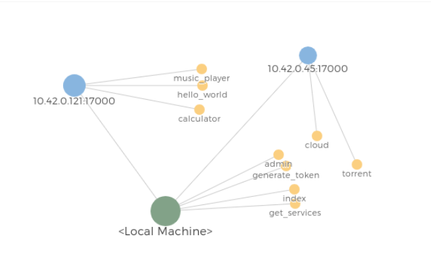

> Ultra tesla es un proyecto de código abierto para crear redes distribuidas de servicios, fácil, rápido y seguro, usando el poder de computo de múltiples ordenadores en una única interfaz.

## ¿Qué hay de nuevo?

En la última versión si hicieron grandes cambios, se arreglaron varios errores y se mejoraron muchas funcionalidades. Entre las más destacadas:

* Posibilidad de transferir grandes cantidades de datos (probado con 3.5 GiB)
* Eficiencia en cuanto a procesamiento y usabilidad en la memoria
* Esquema de cifrado AES-GCM/RSA/SHA3 cambiado por uno más eficiente pero que ofrece la misma seguridad: x25519-xsalsa20-poly1305MAC y para la firma de los datos: ed25519.
* UTeslaCLI ahora carga el triple de rápido y consume menos recursos.
* Ya no se usa HTTP, ahora se usa simplemente TCP y en la capa de aplicación: ProtoTesla
* Ahora es mucho más modular. Antes las funcionalidades que creaban la infraestructura de Ultra Tesla estaban en el mismo núcleo, lo cual hacía que fuera difícil de mantener a corto y largo plazo, por lo que se optó por transformar esas funcionalidades en servicios independientes.
* Ya no se modifica el código en tiempo de ejecución (lo cual era catastrófico); se optó por usar composición.

Entre los fallos arreglados:

* No se podía usar SSL en el cliente MySQL
* No se podía usar un proxy
* Cuello de botella en el núcleo
* Se usaba reflexión sin una lista exclusiva de atributos permitidos
* Condición de carrera cuando varios clientes se conectaban y usaban el mismo usuario
* Ya no se autorecargan los módulos en tiempo de ejecución (lo cual era catastrófico y lento)

## Wiki y documentación

* [Instalación](https://github.com/UltraTesla/UTesla/wiki/Instalación)
* [Introducción](https://github.com/UltraTesla/UTesla/wiki/Introducci%C3%B3n)
* [Tipos de usuarios](https://github.com/UltraTesla/UTesla/wiki/Tipos-de-usuarios)
* [Cómo crear un servicio](https://github.com/UltraTesla/UTesla/wiki/Cómo-crear-un-servicio)

## TODO

* Probarlo en más sistemas unix-like y otros, como Windows.
* Transferir mucho más rápido los datos de gran magnitud
* Subirlo a AUR

~ DtxdF
